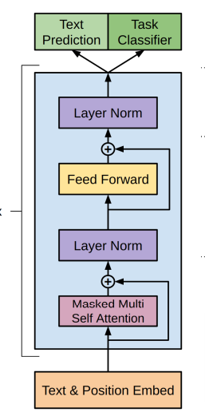

# fine-tune

 一个关于微调的教程，还有各种demo

## LLM+4-bit quantization+Lora

* [Inference notebook](https://colab.research.google.com/drive/1ge2F1QSK8Q7h0hn3YKuBCOAS0bK8E0wf?usp=sharing)
* [Finetuning notebook](https://colab.research.google.com/drive/1VoYNfYDKcKRQRor98Zbf2-9VQTtGJ24k?usp=sharing)

## 函数库

## GPT

## BERT

## Transformer

